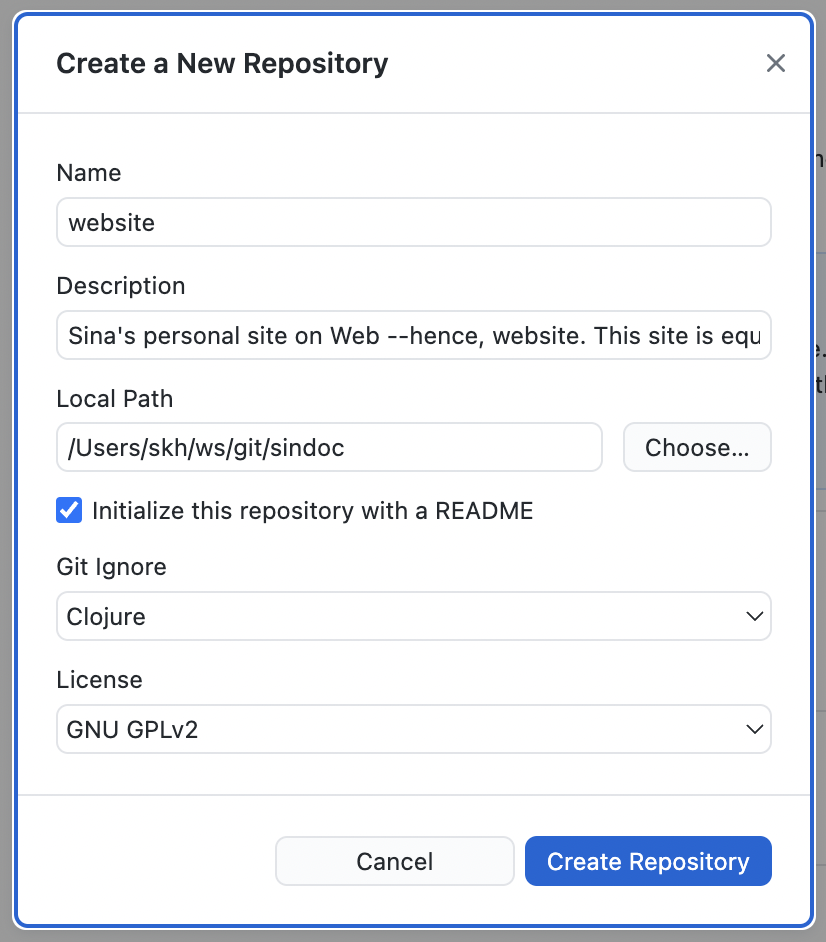
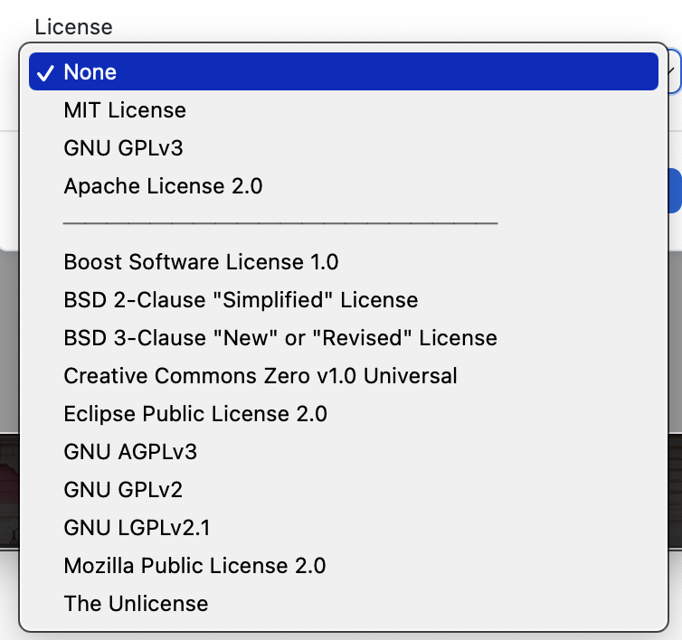
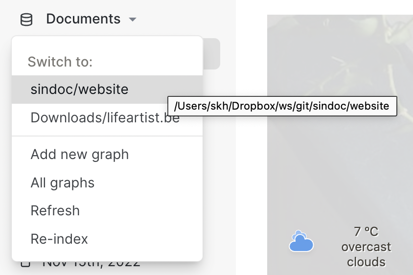
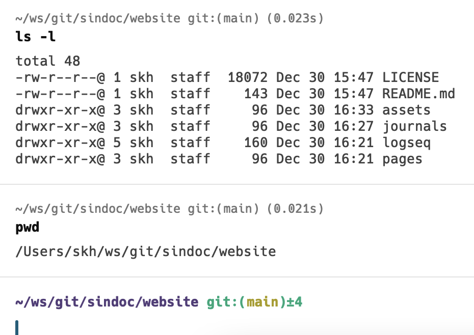
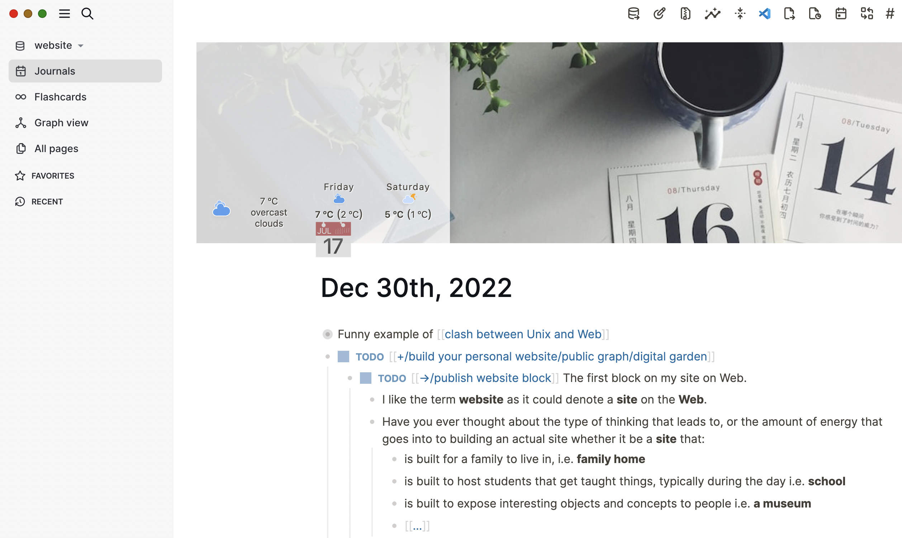
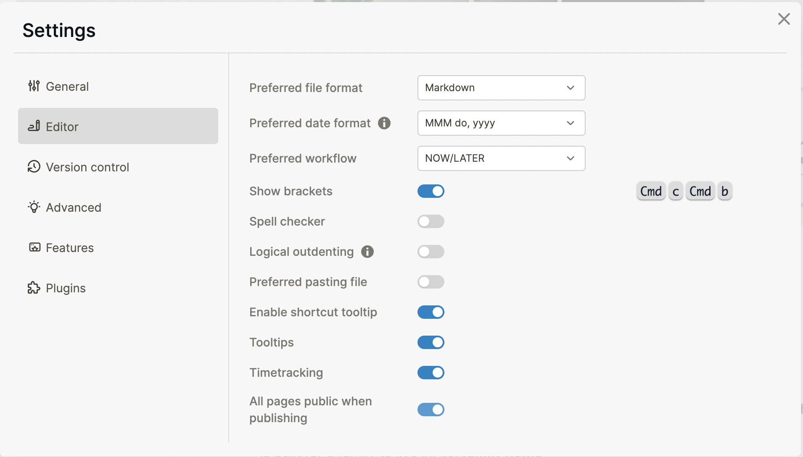

### DONE 11:42 [[+/build your personal website/public graph/digital garden]]
collapsed:: true
:LOGBOOK:
CLOCK: [2022-12-31 Sat 01:24:29]--[2023-01-02 Mon 14:52:18] =>  61:27:49
:END:
	- DONE [[->/publish website block]] The first block on my site on Web.
		- ## Welcome to my website / public graph 😊
		- I like the term **website** as it could denote a **site** on the **Web**.
		- Have you ever thought about the type of thinking that leads to, or the amount of energy that goes into to building an actual site whether it be a **site** that:
			- is built for a family to live in, i.e. **family home**
			- is built to host students that get taught things, typically during the day i.e. **school**
			- is built to expose interesting objects and concepts to people i.e. **a museum**
			- [[...]]
		- I really do see this website, primarily as a site, that happens to be built in the digital world, and distributed over the World Wide Web.
		- Most sites are built, as a form of expression by their architect or commissioner of the site. This site is no different. It is **a form of expression**. And like I said, it's simply a website. A concept that has already existed since 30+ years, as of the writing of this block.
		- Sites are built with different types of building blocks. A combination of different types of building blocks are grouped in different divisions and compartments of the site.
		- This site is no different in that regard, except for the nature of the blocks.
		- The blocks that help build **this site are not made of brick and mortar**. But they are made of bytes, Unicode characters, structured or unstructured content, to help communicate with my audience. An audience we may call knowledge artists, or not. I will soon write of course, the audience I intend to achieve, with this site.
		- I have seen more and more people referring to websites as *digital gardens*. Sure, a site would only become more useful it were to have a garden as part of it.
		- [[...has colophon...]]
		  collapsed:: true
			- I am building this website using [Logseq](https://logseq.com/) and GitHub
			- You're not supposed to have a lot of hard technical skills to be able to publish a website like this. I might write more and more about how one can publish a website like this.
			- The following steps show how it's done, you can safely skip anything below this sub-block.
				- DONE [[->/follow steps in the video]] to publish a website using [[GitHub]] and [[Logseq]]
					- {{video https://www.youtube.com/watch?v=UYqJcFEYUsY}}
						- #+BEGIN_NOTE
						  The look and feel of the screenshots below may be different from a vanilla Logseq environment, simply because I have installed a few plugins, following recommendations from the following video, thanks to the Tools on Tech channel
						  #+END_NOTE
							- (expand this block to see the video)
								- {{video https://youtu.be/7yVdh7ITvz4}}
						- LATER {{youtube-timestamp 13}}  [[->/initialise a GitHub repository]]
						  collapsed:: true
							- LATER Use [[command-line]] or via GitHub Desktop
							  collapsed:: true
								- {:height 429, :width 410}
								- Choose Git Ignore style, for now, since I'm using Logseq, I chose Clojure. But that's probably the wrong choice if I'm going to focus more on Javascript as the language of choice. In fact, as a former Lisper, you always have a bias for Lisp because of its power. But I also want my writing to be understood by using standards that have evolved within large communities. And in terms of the community and standard process, what Javascript has achieved is seldom comparable with any other programming language. And Clojure is a gift to humanity from the heavens, but while I think that the Lisp paradigm is still very much alive and kicking, there's probably still more value in promoting a language that has been standardised and has been adapted rapidly to represent the state of the art in programming languages. This is by the way, by no means meant to mean any disrespect to any community out there, standing up for their programming language of choice. It's just a matter of scale in the responsibilities assigned to a platform such as Web, which Javascript (EMCAscript) represents.
								- Choose the License
									- For now, I'll go with GPLv2, following along the copyleft tradition but I might change this in the future.
									- These are the choices i.e. [[List of allowed values for Open Source Licenses]]
										- {:height 272, :width 236}
						- LATER {{youtube-timestamp 33}} Navigate to the graph that you intend to make public, either you create a fresh one, which is what I did here, or if you make an existing graph, public, that's up to you.
						  collapsed:: true
							- {:height 296, :width 304}
							- {:height 204, :width 300}
						- LATER {{youtube-timestamp 40}} Add some content, including a few pages
						  collapsed:: true
							- 
						- LATER {{youtube-timestamp 48}} Tell Logseq that all pages in this graph are supposed to be public.
						  collapsed:: true
							- This is useful, for otherwise, each page has to be declared public, which may not be practical to maintain.
							- 
							-
-