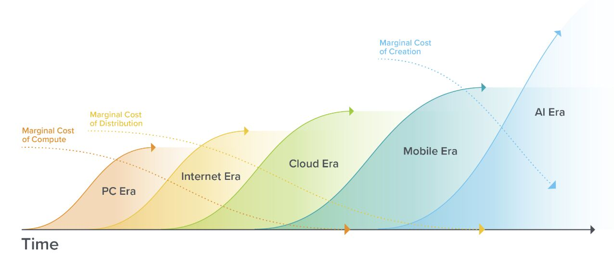
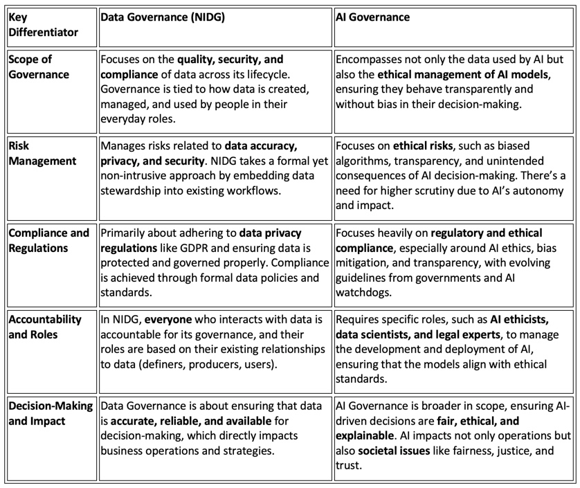

- [[research]] on [[open-source]] [[LLM]] [[dev]] by [Chip Huyen](https://huyenchip.com/)
  collapsed:: true
	- [LLM Open Source Resources](https://huyenchip.com/llama-police)
	- [LLM Open Source Resources.csv](../assets/LLM_Open_Source_Resources_1726129244438_0.csv)
	- Add missing repos to the list?
	  collapsed:: true
		- There's a [form](https://docs.google.com/forms/d/e/1FAIpQLScQZ23IPZsSjjUECNY8Ae5v7IdaHbHjvrLXknb7O2QZrohmnQ/viewform)
		-
	- [What the author learned from looking at 900 most popular open source AI tools](https://huyenchip.com/2024/03/14/ai-oss.html)
	- [Open Source LLM Developers](https://huyenchip.com/llama-devs)
	- #HN [Hacker News Discussion](https://news.ycombinator.com/item?id=39709912)
- DOING Publish [[AI Governance/Tools/Gender Bias Detector]]
  :LOGBOOK:
  CLOCK: [2024-09-12 Thu 20:52:13]
  :END:
-
	- 
		- Source
			- Angela Strange from https://a16z.com/
- {:height 506, :width 591}
	- Source
	  collapsed:: true
		- Bob Seiner
			- https://www.linkedin.com/pulse/power-data-vs-ai-governance-robert-s-seiner-rd95e/
- https://www.soda.io/resources/15-min-demo?utm_source=SinDoc
	- [[Soda DQ]] Explained
- https://www.nannyml.com/library?utm_source=SinDoc
	- [[NannyML OSS]]
	-
	-