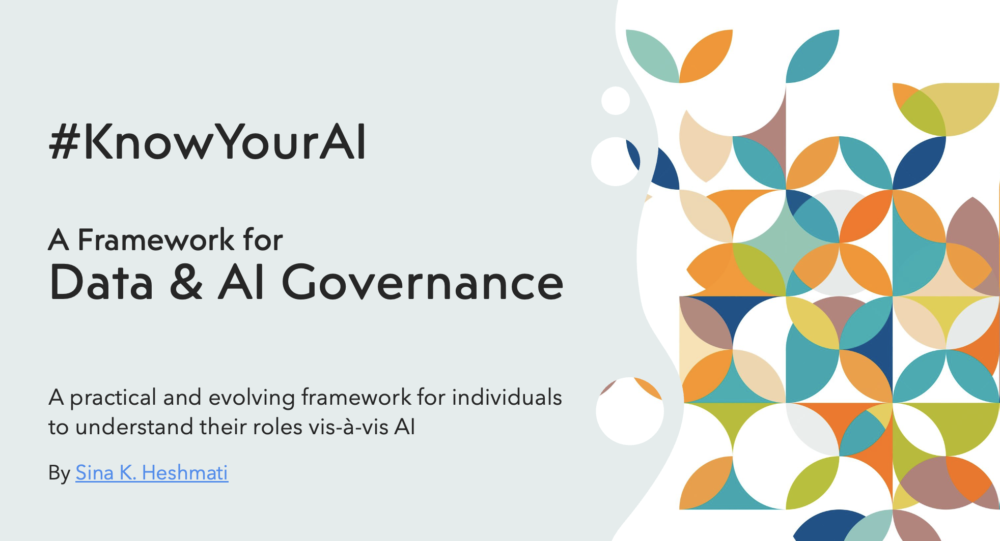

alias:: the KnowYourAI framework

- 
  id:: 66f17ec1-0273-42e8-a8d5-f16b6658781e
	- ### Features
		- [[Data & AI Governance/Policies]]
		- [[Human-AI Relationships Glossary]]
		- [[AI Governance/Tools/Bias Detector]]
			- [[AI Governance/Tools/Gender Bias Detector]]
			- [[AI Governance/Tools/Age Bias Detector]]
		- [[MIT/AI Risks/Database]]
		- [[AI use cases]]
			- Detailed mapping of **risks**, **policies**, **datasets**, data **domains**, and **data products**
				- [[Use Cases/Financial Services/Investment Management]]
		- Repository Home on **GitHub**
			- https://github.com/sindoc/knowyourai-framework
			- #### [[Latest release]]
				- [[KnowYourAI/v0.1.0]]
			- The original [blog post](https://lutino.substack.com/p/navigating-the-ai-transition-a-good) that introduced this framework